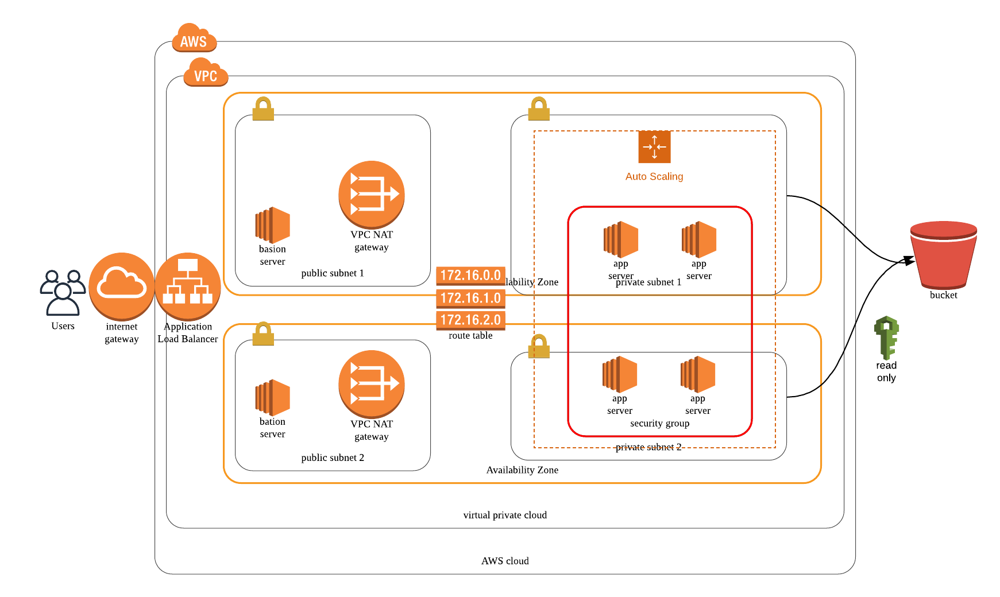

# Cloud DevOps Engineer

## Project 1: Deploy Static Website on AWS

- Submission date: May 16th 2020. 
- Submission Folder: project_1

Principal outcome is the static website hosted by AWS. 

http://cyonemori-website.s3-website-ap-northeast-1.amazonaws.com/

## Project 2: Deploy a high-availability web app using CloudFormation

- Submission date: June 7th 2020. 
- Submission Folder: project_2
    - infra code: project2_aws_infra.yml
    - parameter set: param.json 

### Diagram which I create for the project

### Output: web app URL
http://udaci-webap-1pw0bmhv6c21c-329477252.ap-northeast-1.elb.amazonaws.com/

